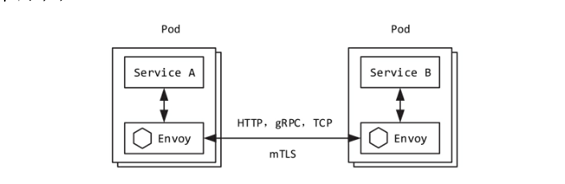
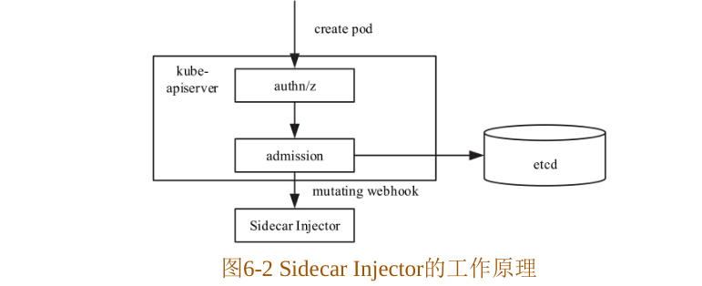

# Sidecar 机制
Istio的流量管理、遥测、治理等功能均需要通过下发配置规则到应用所在的运行环境执行才能生效，而部分执行这些配置规则的组件在服务网格中被称为`服务代理`。我们通常将承载服务的实体称为`应用`，将承载服务代理的实体称为应用 Sidecar （简称 Sidecar）。这里主要讲解服务网格中这种特殊、透明的 Sidecar 技术。

## Sidecar 注入
我们都知道，Istio的`流量管理`、`策略`、`遥测`等功能无需应用程序做任何改动，这总无侵入式的方式全部依赖于 Sidecar。应用程序发送或者接受的流量都被 Sidecar 拦截，并由 Sidecar 进行`认证`、`鉴权`、`策略执行`及遥测数据上报等众多治理功能。
如下图所示，在 Kubernetes 中，Sidecar 容器与应用容器共存于同一个 Pod 中，并且共享同一个 Network Namespaces，因此 Sidecar 容器与应用容器共享同一个网络协议栈，这也是 Sidecar 能够通过 iptables 拦截应用进出口流量的根本原因。



在 Istio 中进行 Sidecar 注入有两周方式：一种是通过 istioctl 命令行工具手动注入，另一种是通过 Istio Sidecar Injector 自动注入。这两种方式的最终目的是在应用 Pod 中注入 init 容器及 istio-proxy 容器这两个 Sidecar 容器。乳腺所示，通过部署 Istio 的 sleep 应用，Sidecar 是通过 sidecar-injector 自动注入的，查看注入的 Sidecar 容器：

```yaml
Name:               user-service-5965bc4987-bh568
Namespace:          aihua
Priority:           0
PriorityClassName:  <none>
Node:               cn-beijing.172.17.19.250/172.17.19.250
Start Time:         Fri, 13 Mar 2020 15:53:31 +0800
Labels:             app=user-service
                    pod-template-hash=5965bc4987
                    security.istio.io/tlsMode=istio
                    version=v1
Annotations:        sidecar.istio.io/status:
                      {"version":"634c3930250e07bc207c111bdd0cd2bc7c496e9d2bbd0306cd5ecc0559ba2c89","initContainers":["istio-init"],"containers":["istio-proxy"]...
Status:             Running
IP:                 172.20.0.97
Controlled By:      ReplicaSet/user-service-5965bc4987
Init Containers:
  istio-init:
    Container ID:  docker://756100b9b947791a92b1d187a1d1e352f10fabb39a2aaae66ee66111ab3b50e1
    Image:         registry.cn-beijing.aliyuncs.com/acs/proxyv2:1.4.6
    Image ID:      docker-pullable://registry.cn-beijing.aliyuncs.com/acs/proxyv2@sha256:e26a4807465589f2de65bdf9cd2e9d9ec246a737ce2dbc2ffa6d5dfda5cc069f
    Port:          <none>
    Host Port:     <none>
    Command:
      istio-iptables
      -p
      15001
      -z
      15006
      -u
      1337
      -m
      REDIRECT
      -i
      *
      -x

      -b
      *
      -d
      15020
    State:          Terminated
      Reason:       Completed
      Exit Code:    0
      Started:      Fri, 13 Mar 2020 15:53:33 +0800
      Finished:     Fri, 13 Mar 2020 15:53:34 +0800
    Ready:          True
    Restart Count:  0
    Limits:
      cpu:     100m
      memory:  50Mi
    Requests:
      cpu:        10m
      memory:     10Mi
    Environment:  <none>
    Mounts:       <none>
Containers:
  user-service:
    Container ID:   docker://3e06f23a4a71a8cdf4b3c843ffbd1b0e7ab4166c0e33009869bd5e9530972965
    Image:          registry.cn-hangzhou.aliyuncs.com/dapeng-aihua/user-service:latest
    Image ID:       docker-pullable://registry.cn-hangzhou.aliyuncs.com/dapeng-aihua/user-service@sha256:76ec879c0dfe55a774c9605dab1e7bfc32fa05b88c7d740881371c3b37f33d11
    Port:           8080/TCP
    Host Port:      0/TCP
    State:          Running
      Started:      Fri, 13 Mar 2020 15:53:40 +0800
    Ready:          True
    Restart Count:  0
    Limits:
      memory:  512Mi
    Requests:
      memory:  512Mi
    Environment:
      SPRING_PROFILES_ACTIVE:  prod
      DB_URL:                  jdbc:mysql://114.67.112.144:32350/dapeng_children_test?useUnicode=true&characterEncoding=UTF-8&zeroDateTimeBehavior=convertToNull&autoReconnect=true
      DB_USERNAME:             root
      DB_PASSWORD:             root
      TOKEN_KEY_URI:           http://oauth2-server/oauth/token_key
      HOSTNAME:                user-service
      JAVA_TOOL_OPTIONS:       -Xmx450m  -Xss256k
    Mounts:
      /var/run/secrets/kubernetes.io/serviceaccount from default-token-2tnk7 (ro)
  istio-proxy:
    Container ID:  docker://1e90e0c730031a264c66c185e4948dbeeaefe1d8bbcbddb17b4343361af03f17
    Image:         registry.cn-beijing.aliyuncs.com/acs/proxyv2:1.4.6
    Image ID:      docker-pullable://registry.cn-beijing.aliyuncs.com/acs/proxyv2@sha256:e26a4807465589f2de65bdf9cd2e9d9ec246a737ce2dbc2ffa6d5dfda5cc069f
    Port:          15090/TCP
    Host Port:     0/TCP
    Args:
      proxy
      sidecar
      --domain
      $(POD_NAMESPACE).svc.cluster.local
      --configPath
      /etc/istio/proxy
      --binaryPath
      /usr/local/bin/envoy
      --serviceCluster
      user-service.$(POD_NAMESPACE)
      --drainDuration
      45s
      --parentShutdownDuration
      1m0s
      --discoveryAddress
      istio-pilot.istio-system:15010
      --zipkinAddress

      --proxyLogLevel=warning
      --proxyComponentLogLevel=misc:error
      --dnsRefreshRate
      300s
      --connectTimeout
      10s
      --proxyAdminPort
      15000
      --controlPlaneAuthPolicy
      NONE
      --statusPort
      15020
      --applicationPorts
      8080
      --concurrency
      2
    State:          Running
      Started:      Fri, 13 Mar 2020 15:53:41 +0800
    Ready:          True
    Restart Count:  0
    Limits:
      cpu:     2
      memory:  1Gi
    Requests:
      cpu:      100m
      memory:   128Mi
    Readiness:  http-get http://:15020/healthz/ready delay=1s timeout=1s period=2s #success=1 #failure=30
    Environment:
      POD_NAME:                            user-service-5965bc4987-bh568 (v1:metadata.name)
      ISTIO_META_POD_PORTS:                [
                                               {"name":"web","containerPort":8080,"protocol":"TCP"}
                                           ]
      ISTIO_META_CLUSTER_ID:               Kubernetes
      POD_NAMESPACE:                       aihua (v1:metadata.namespace)
      INSTANCE_IP:                          (v1:status.podIP)
      SERVICE_ACCOUNT:                      (v1:spec.serviceAccountName)
      ISTIO_META_POD_NAME:                 user-service-5965bc4987-bh568 (v1:metadata.name)
      ISTIO_META_CONFIG_NAMESPACE:         aihua (v1:metadata.namespace)
      SDS_ENABLED:                         false
      ISTIO_META_INTERCEPTION_MODE:        REDIRECT
      ISTIO_META_INCLUDE_INBOUND_PORTS:    8080
      ISTIO_METAJSON_LABELS:               {"app":"user-service","pod-template-hash":"5965bc4987","version":"v1"}

      ISTIO_META_WORKLOAD_NAME:            user-service
      ISTIO_META_OWNER:                    kubernetes://apis/apps/v1/namespaces/aihua/deployments/user-service
      TERMINATION_DRAIN_DURATION_SECONDS:  5
    Mounts:
      /etc/certs/ from istio-certs (ro)
      /etc/istio/proxy from istio-envoy (rw)
      /var/run/secrets/kubernetes.io/serviceaccount from default-token-2tnk7 (ro)
Conditions:
  Type              Status
  Initialized       True
  Ready             True
  ContainersReady   True
  PodScheduled      True
Volumes:
  default-token-2tnk7:
    Type:        Secret (a volume populated by a Secret)
    SecretName:  default-token-2tnk7
    Optional:    false
  istio-envoy:
    Type:       EmptyDir (a temporary directory that shares a pod's lifetime)
    Medium:     Memory
    SizeLimit:  <unset>
  istio-certs:
    Type:        Secret (a volume populated by a Secret)
    SecretName:  istio.default
    Optional:    true
QoS Class:       Burstable
Node-Selectors:  <none>
Tolerations:     node.kubernetes.io/not-ready:NoExecute for 300s
                 node.kubernetes.io/unreachable:NoExecute for 300s
Events:          <none>

```

### Sidecar Injector 自动注入的原理

Sidecar Injector 是 Istio 中实现自动注入 Sidecar 的组，它是以 kubernetes 注入控制器 Admission Controller 的形式运行的。 Admission Controller 的基本工作原理是拦截 Kube-apiServer的请求，在对象持久化之前、认证鉴权之后进行拦截。Admission Controller 有两种：一种是内置的，另一种是用户自动以的。Kubernetes 允许用户以 Webhook的方式自动以注入控制器，Sidecar Injector 就是这样一种特殊的 MutatingAdmissionWebhook。

如下图所示，Sidecar Injector 只在创建 Pod 时进行 Sidecar 容器注入，在 Pod 的创建请求到达 Kube-apiserver 后，首先进行认证鉴权，然后在注入控制阶段，Kube-apiserver 以 REST 的方式同步调用 Sidecar Injector Webhook 服务进行 init 与 istio-proxy 容器的注入，最后将 Pod 对象持久化到存储到 ectd 中。  



Sidecar Inject 可以通过 MutatingWebhookConfiguration API 动态配置生效，Istio 中的 MutatingWebhook配置如下：

```yaml
Name:         istio-sidecar-injector
Namespace:
Labels:       app=istio-sidecar-injector
Annotations:  <none>
API Version:  admissionregistration.k8s.io/v1beta1
Kind:         MutatingWebhookConfiguration
Metadata:
  Creation Timestamp:  2020-02-01T13:48:56Z
  Generation:          34
  Owner References:
    API Version:           istio.alibabacloud.com/v1beta1
    Block Owner Deletion:  true
    Controller:            true
    Kind:                  Istio
    Name:                  istio-config
    UID:                   94d9ccb4-44f9-11ea-bc12-223dbb0f0c47
  Resource Version:        394871325
  Self Link:               /apis/admissionregistration.k8s.io/v1beta1/mutatingwebhookconfigurations/istio-sidecar-injector
  UID:                     971c5954-44f9-11ea-b65f-02825e36907a
Webhooks:
  Admission Review Versions:
    v1beta1
  Client Config:
    Ca Bundle:  LS0tLS1CRUdJTiBDRVJUSUZJQ0FURS0tLS0tCk1JSUMzakNDQWNhZ0F3SUJBZ0lSQU1tTzhpa00yRXVVMi9TUzQxbDVINXd3RFFZSktvWklodmNOQVFFTEJRQXcKR0RFV01CUUdBMVVFQ2hNTlkyeDFjM1JsY2k1c2IyTmhiREFlRncweU1EQXlNREV4TXpRNU1ETmFGdzB6TURBeApNamt4TXpRNU1ETmFNQmd4RmpBVUJnTlZCQW9URFdOc2RYTjBaWEl1Ykc5allXd3dnZ0VpTUEwR0NTcUdTSWIzCkRRRUJBUVVBQTRJQkR3QXdnZ0VLQW9JQkFRQzlMNjQwWFFuQmJ1dlptVVZESFR6TEU1Z3F4dTZLdkxpRS80d08KdGlTbWZhRW0rUno5SXZWdXNsTTRNR0c0SWtpckdFalNZTy9oVjhSbFZFdE5VaG81TmVhWmtIZzF0ZGNiU0lsRApjOXBWWEYra2UrYmJ3T2lKQitOMVFWTjRVVW1SWUw3SU9wUlZzTWU5d1dBRUxBZG4ydURabzgwaDh5QUd5OXdkCmgreEFMYUMwOGZyaCtmU1ozMFloUXJPZXltdzJmazNDVlgveDlqS2pGcFlXZ3VqSmkwbDM3OUdYOU9BUkNDWU4KQXhYY3RmdzNNMlJ6bzF4b1ErVFpaaEZWN0dXUERlSXpQaGhScldQV3hkU29ZL3NwQWtvV2toM3liViszWDUrUAprOXZ3T3lsUEdmejYvdnExVTF1OHdSSnBGZWN2c3FicmtjY2p0Qll5dUR1aU1udWJBZ01CQUFHakl6QWhNQTRHCkExVWREd0VCL3dRRUF3SUNCREFQQmdOVkhSTUJBZjhFQlRBREFRSC9NQTBHQ1NxR1NJYjNEUUVCQ3dVQUE0SUIKQVFCZDN4OGtUTWJBYy9XNUNXeXlyZXE5cmQrL2g1YWgxZ1BmZG41RFd0T1dnT2Y0V3B3bWZ5VmV4YStrZG9SYgpoOGZMejVWRDVGaGtGTzlBdlVTQzNDOUdjQ3NYd1NyOGVsbEM1c3VmWnpGdmlyTkd2YXBENVJxeU4xTTB5QVR5CnZsRVFlTEc3WjZXcE5QSEo1YlcweW04NjBFYW44cDBhZlFua3NLWlY2bHA2bGF3RUt6ZEpldGNFT24zQ2ozRVUKUDI0dW5HR3plM1RaNUgwelI3U3hoeDNNdEVKNnlmUkhaQUFJdnpjVWRvaFdDdzJRajlyQ0R1bVJqUnhMa0E1NgorSU9rVGJOM0ZVWS9ZamhGV3dmM0RnTzdTd3dsNjU3TVVEakNmcTF6dXNXUllIRWRxVGYzS3dEOWpnQW9uUTNECnEvTTVMdmxmczBaNHNwTDZ1OXM4TERSZQotLS0tLUVORCBDRVJUSUZJQ0FURS0tLS0tCg==
    Service:
      Name:        istio-sidecar-injector
      Namespace:   istio-system
      Path:        /inject
  Failure Policy:  Fail
  Name:            sidecar-injector.istio.io
  Namespace Selector:
    Match Labels:
      Istio - Injection:  enabled
  Rules:
    API Groups:

    API Versions:
      *
    Operations:
      CREATE
    Resources:
      pods
    Scope:          *
  Side Effects:     Unknown
  Timeout Seconds:  30
Events:             <none>

```

从以上配置可知，Sidecar Injector 只对标签匹配 “istio-injection: enabled” 的命名空间下的 Pod 资源对象的创建生效。Webhook 服务的访问路径为 “/inject”，地址以及访问凭证等都在 clientConfig 字段下进行配置。

Istio Sidecar Injector 组件是由 sidecar-injector 进程实现，本书在之后将二者视为同一概念。Sidecar Injector 的实现主要由两部分组成：

- 维护 MutatingWebhookConfiguration 。
- 启动 Webhook Server，为应用工作负载自动注入 Sidecar 容器。

MutatingWebhookConfiguration 对象的维护主要指监听本地证书的变化及 Kubernetes MutatingWebhookConfiguration 资源的变化，以检查 CA证书或者 CA 数据是否有更新，并且在本地 CA 证书与 MutatingWebhookConfiguration 中的 CA 证书不一致时，自动更新 MutatingWebhookConfiguration 对象。

### Sidecar 注入的实现

Sidecar Injector 以轻量级 HTTPS 服务器的形式处理 Kube-apiserver 的 AdmissionRequest 请求。目前 Kubernetes Admission Webhook 都不支持双休认知，所以 Sidecar Injector 服务器并不校验客户端证书。


本篇大量摘抄自《云原生服务网格Istio: 原理、实践、架构与源码》

## 参考
- 《云原生服务网格Istio: 原理、实践、架构与源码》